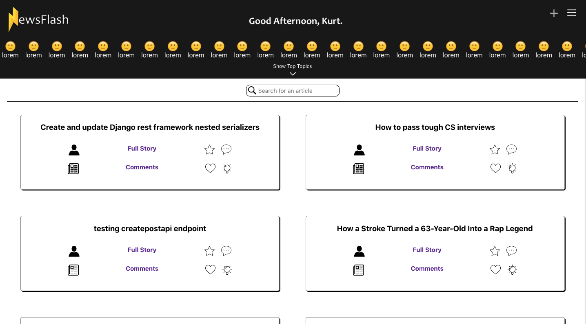

# NewsFlash

NewsFlash is an application that allows users to view personalized up-to-date news articles and choose to view articles of their choosing from a wide range of topics. The front-end of this application is built with React.js, Redux and React Router and styled with SASS.

### [App Deployed Here](https://newsflash-front.herokuapp.com/)

#### Note:

Once at the Login page use these credentials:

###### username: newsbot

###### password: qwerty23

## Getting Started:

#### Clone this repository:

`git clone https://github.com/thatSunshineKid/Newsflash-front.git`

#### Then:

`cd Newsflash-front/`

#### Then run:

`npm install`

#### To start the application, run:

`npm start`

#### Once at the Login page:

You will be redirected to the Login page, because you have not been authenticated as a user yet.

##### Login to the temporary account using these credentials:

###### username: newsbot

###### password: qwerty23

## Home Page:

